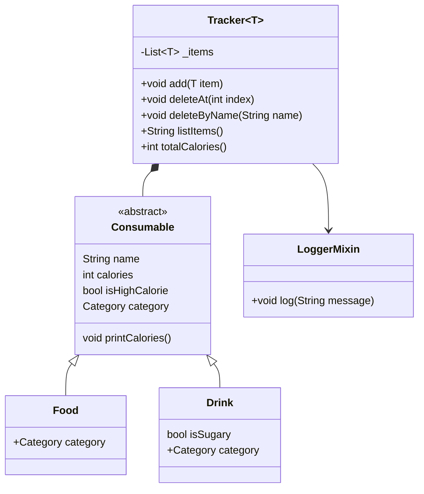

# Dart Food & Drink Tracker

This project is a command-line food and drink tracking app built with Dart. It allows users to log meals and beverages, categorize them, monitor calorie intake, and receive alerts when limits are exceeded. The app demonstrates key Dart language features and clean, object-oriented design.

**Author:** Duong Tran

---

## Features

- **Consumable Abstraction**: Defines a common interface for food and drink.
- **Category Enum**: Assigns category tags like Food and Drink, can be built upon later on.
- **Calories Tracking**: Calculates total calories and give a warning when total calories exceed a daily limit of 1500.
- **Generics**: `Tracker<T>` handles any `Consumable` type.
- **Mixins**: `LoggerMixin` adds timestamped logging to actions (when item is added or deleted).
- **Extension Methods**: Adds behavior like string capitalization and calorie parsing.
- **CLI Interface**: Interacts with users through stdin for adding, listing, and deleting items.
- **Error Handling**: Catches invalid input when entering menu choice and guides user back to the main flow.
- **Data Validation**: Ensures calorie input is numeric and sensible.
- **Asynchronous Operations (Future)**: Uses async/await for simulating time delays (2 seconds) when first starting the program

---

## Code Structure

### `Consumable`
Abstract class that defines the base properties for all items (food, drink).

```dart
abstract class Consumable {
  String name;
  int calories;
  bool get isHighCalorie;
  Category get category;
  void printCalories();
}
```
### `Food and Drink`
Concrete implementations of Consumable. Drink includes an isSugary property.

```dart
class Food extends Consumable {
  final Category category;
  ...
}

class Drink extends Consumable {
  final Category category;
  final bool isSugary;
  ...
}
```
###`Tracker<T extends Consumable>`
Generic tracker that handles logging and list management.

```dart
class Tracker<T extends Consumable> with LoggerMixin {
  void add(T item);
  void deleteAt(int index);
  void deleteByName(String name);
  String listItems();
  int totalCalories();
}
```

###`LoggerMixin`
Logs timestamped messages for actions like add and delete.

```dart
mixin LoggerMixin {
  void log(String message);
}
```
###`Extensions`

CalorieParser: Parses and validates calorie strings.
Capitalize: Capitalizes user input names.

```dart
extension CalorieParser on String { ... }
extension Capitalize on String { ... }
```

###`Category Enum`
Organizes types of food/drink for clarity and grouping.

```dart
enum Category {
  food,
  drink
}
```
## Features Key Dart Features Demonstrated
Null safety

Abstract classes and inheritance

Mixins

Extension methods

Generics

Enums

Input validation

Error handling

CLI interaction using stdin

## Features Main Workflow
1. Show welcome message.

2. Prompt the user with menu options.

3. Based on input:
- Handle invalid input or value
- Add a food or drink item with calorie and category.
- Display logs and warnings for high-calorie or sugary intake.
- Delete food or drink by its name.
- View all items or calorie summaries.
- Repeat menu until the user chooses to exit.
4. Exit program

## Class Diagram

## Flow Diagram
```mermaid
flowchart TD
    Start([Start])
    InputItem[/"User adds a consumable item"/]
    AddToTracker["Tracker adds item to list"]
    ShowList["Tracker lists all items"]
    CalculateTotal["Tracker calculates total calories"]
    DeleteItem[/User deletes item by name/]
    UpdateList["Tracker updates item list"]
    ShowTotal["Show updated total calories"]
    End([End])

    Start --> InputItem
    InputItem --> AddToTracker
    AddToTracker --> ShowList
    ShowList --> CalculateTotal
    CalculateTotal --> DeleteItem
    DeleteItem --> UpdateList
    UpdateList --> ShowList
    ShowList --> ShowTotal
    ShowTotal --> End

    
